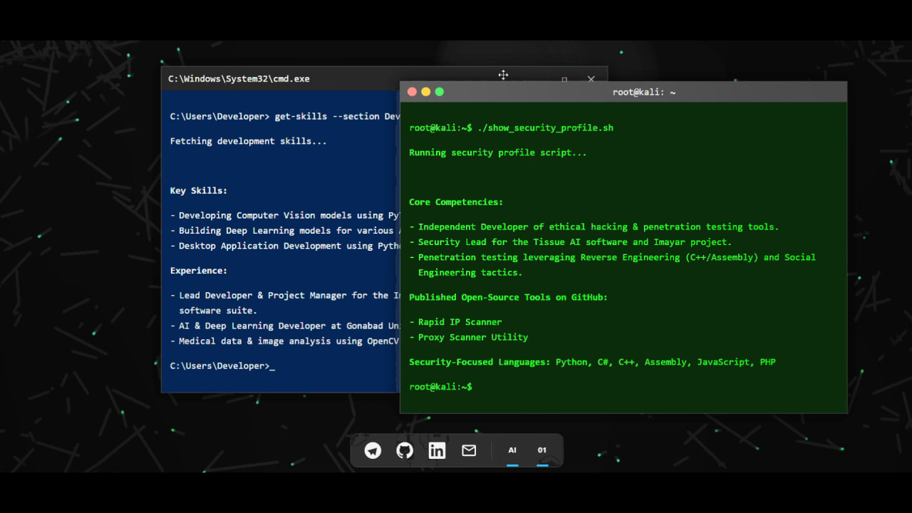

# Interactive Desktop-Style Resume

[](https://developer.mozilla.org/en-US/docs/Web/Guide/HTML/HTML5)
[](https://developer.mozilla.org/en-US/docs/Web/CSS)
[](https://developer.mozilla.org/en-US/docs/Web/JavaScript)

A creative and interactive personal resume designed as a desktop environment simulation. This project aims to showcase front-end development skills and creativity beyond a traditional CV.

### **[View Live Demo 🚀](https://imfard.ir)**

[](https://github.com/amirrezamortazavifard/interactive-resume/blob/main/demo/Recording%202025-06-27%20032143.mp4)

*(Click the image above to watch the full video demo)*

---

## 📜 About The Project

This project was built to move beyond static resumes and offer a unique, engaging user experience. Visitors can interact with a familiar desktop environment, drag and drop windows, manage applications via a functional taskbar, and enjoy dynamic visual effects.

The entire project is built from the ground up using only **vanilla HTML, CSS, and JavaScript**, with no external frameworks or libraries, demonstrating a strong understanding of core web technologies.

---

## ✨ Features

* **Desktop Environment Simulation** with a dynamic, animated "aurora" background.
* **Interactive Spotlight Effect** that follows the mouse to reveal hidden text.
* **Two Fully Draggable Terminal Windows** with independent content and styling.
* **Distinct Theming** for each window, mimicking Windows and Linux environments.
* A modern, **Windows 11-style Taskbar** with a glassmorphism effect.
* Functional taskbar icons for social links and **application state management**.
* Ability to **Minimize and Restore** windows via their title bar buttons or by clicking their corresponding taskbar icons.
* **Smooth, fluid animations** for all interactions using CSS Transitions.
* A **dynamic, animated favicon** in the browser tab.

---

## 🛠️ Technologies Used

* **HTML5**
* **CSS3**
    * Flexbox
    * CSS Transitions & Animations
    * Backdrop Filter
* **JavaScript (ES6+)**
    * DOM Manipulation
    * Event Listeners
    * `requestAnimationFrame` for background animation

---

## 🚀 Getting Started

No complex setup or installation is required. Simply clone the repository and open the `index.html` file in your browser.

```bash
git clone [https://github.com/amirrezamortazavifard/interactive-resume.git](https://github.com/amirrezamortazavifard/interactive-resume.git)
cd interactive-resume
# Open the index.html file in your browser
```

---

## 👤 Creator

**Amirreza Mortazavi Fard (Amir Fard)**

* **Telegram:** [@ReallyFard](https://www.linkedin.com/in/amir-reza-mortazavi-fard-892874368/)
* **LinkedIn:** [Amirreza Mortazavi Fard](https://www.linkedin.com/in/amir-reza-mortazavi-fard-892874368/)
* **Email:** [mortazavi.a.stu@gmu.ac.ir](mailto:mortazavi.a.stu@gmu.ac.ir)

---

## 📄 License

This project is licensed under the MIT License.
